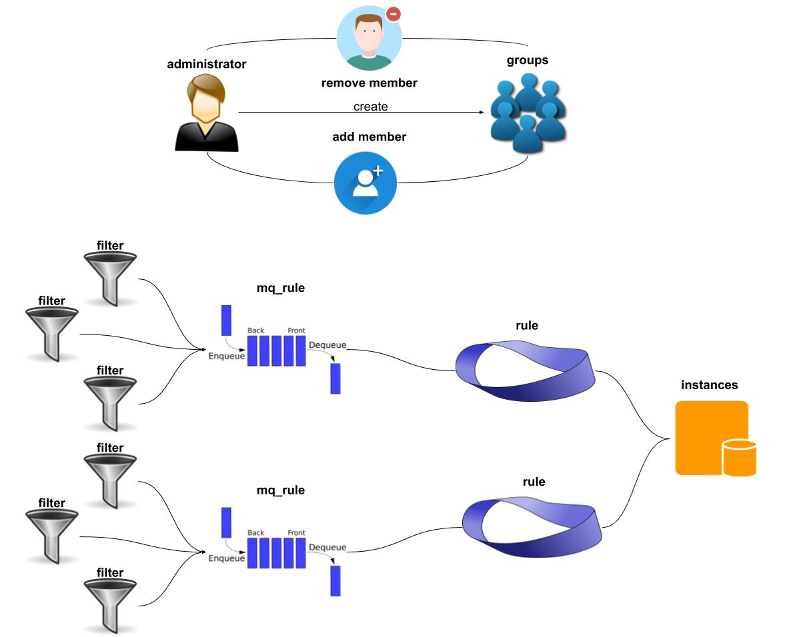

# Binlake-web前端简介
tower类似于灯塔, 负责binlake 实时消息订阅集群管理, 业务端逻辑控制以及与外部系统的交互联动  
tower是整个binlake集群管理平台: 使用的beego框架, 采用bootstrap组件开发完成  

## 规定
* 从manager 端请求有一个永远只有MetaData 一个对象

* 每次输入的对象是一个 MetaData{DbInfo, BinlogInfo, Counter, Candidate}

* 返回结果则是将对应的meta data 填充相应的值结果集合 或者是 {code == 1000, message=""}
 

## 请求说明
* MetaData 
    所有与BinLake-manager交互的服务地址采用的json封装对象   

* 目的  
    可以省略掉很多不必要的参数传递解析麻烦，而且代码的结构较为清晰 


路径 | 作用 | 参数类型 | 返回值类型
--- | --- | --- | --- 
/create/znodes/ | 创建一个ZNode{对应到一个MySQL实例}| MetaData | {"code": 1000, "message":""}
/set/binlog/ | 设置binlog 位置{binlog-file, binlog-pos, gtid} | MetaData | {"code": 1000, "message":""}
/set/online/ | 上线MySQL节点 开始dump数据 | MetaData | {"code": 1000, "message":""}
/set/offline/ | 下线MySQL 节点 停止dump 数据 | MetaData | {"code": 1000, "message":""}
/set/leader/ | 设置MySQL dump 服务节点的leader  | MetaData | {"code": 1000, "message":""}
/set/candidate/ | 设置MySQL dump 服务的备选 节点  | MetaData | {"code": 1000, "message":""}
/reset/counter/ | 重置计数器{retryTimes = 0} | MetaData | {"code": 1000, "message":""}
/master/status | 获取wave dump的MySQL 当前的binlog位置| MetaData | MetaData
/slave/status | 获取wave dump 完成的binlog 位置 | MetaData | MetaData
## 使用说明 

* 下图是元数据设计的表信息  
    

* 设有超级管理员人员配置  
    **超级管理员有所有分组的增删改权限**  
    **该权限目前只能从后台配置, 操作需谨慎**  

* 规定如下
    * 每个实例只能属于一个分组 
    * 每个用户可以属于多个分组
    * 只有组管理员才可以编辑/删除组创建的过滤器,规则etc. 

* 使用要求如下  
    * 尽量要求每次添加的实例属于一个分组 便于查看  

* 表主键说明  
    * groups 表  
        id = md5(${group_name})
    * filter 表  
        id = md5(${group_id}, ${type}, ${table_name})
    * mq_rule 表  
        id = md5(${topic}, ${group_id}, ${filter_id})
    * instances 表  
        id = md5(${host:port})
    * rule 表  
        无主键 但是有唯一索引 {instance_id, rule_id} rule_id 来源与mq_rule表id
    * users 表  
        id = md5(${erp}, ${group_id})
    * super_admin 表  
        无id 但是有主键 primary key{erp}

* 表字段说明  
    [详见创建表注释](../conf/tower.sql)


* dbs 交互说明  
    instances 表当中 表记录按照不同时期分配不同状态 
    init: 初始化状态 
    wait: 等待流程状态 
    unauthorized: 未授权状态
    agree: 流程完成,授权完成批准状态
    oppose: 拒绝状态
    
    * dbs 流程  
    * dbs 授权

  
## 使用说明  
* 前提 
    依赖于go环境
    本地go 版本 **go version go1.12 linux/amd64**

* 编译过程  
    * cd binlake-web目录  
    * bee pack 
        **安装bee {go get github.com/astaxie/beego && go get github.com/beego/bee}**  
    * 如果成功则可以生成 tower.tar.gz   

* 安装使用  
    * 准备一个MySQL server 实例
    * source ../conf/tower.sql  
    * cd binlake-web目录修改 conf/app.conf配置文件  

        属于组 | 变量名 | 修改结果说明  
        --- | --- | ---   
        default | httpport | 80 因为线下机器不通80以外的端口
        db | host | 元数据存放的数据库方位ip  
        db | port | 元数据存放的数据库访问端口
        db | user | 访问元数据库的用户名  
        db | passwd | 访问元数据库的密码  
        db | dbname | 元数据库名  
        manager | url | 后端api 服务的域名地址 {最好使用域名}  
        sso | url | 线上单点登录地址: 去掉test

    * 初始化元数据库  
        mysql> source ../conf/tower.sql

    * 启动服务  
        ```sbtshell
        nohup ./tower > tower.log 2>&1 &
        ```  
    
    * 客户端访问要求  
        客户端访问由于有单点登录 所以需要配置域名类似 xxxxx.jd.com, 其中必须以jd.com结尾

* 参数说明  
参数分为5个模块
    * default模块  
        负责beego框架前后端交互设置;   
        ```text
        [default]
        appname = tower
        httpport = 8081
        runmode = dev
        copyrequestbody = true
        apiTimeOut = 120
        instanceCheckSwitch = true
        sessionOn = true
        ```
    
    *  meta 模块  
        负责元数据库的访问信息 
        ```text
        [meta]
        host = 127.0.0.1
        port = 3306
        user = root
        passwd = secret
        dbname = tower
        charset = utf8
        ```
        
    * dump 模块  
        dump 建议统一配置用户名以及密码, 方便管理, 当然也可以单独配置 
        ```text
        ## binlog dump 统一的用户名和密码
        [dump]
        user = ********
        password = **********
        ```
        
    * manager 模块 
        manager无状态 manager模块可以连接到任意一个zk集群 所以manager也是分布式部署 采用域名的形式访问 
        ```text
        [manager]
        url = http://192.168.200.158:9099/
        token = manager
        timeout = 120
        ```
        
    * sso 单点登录模块  
        单点登录模块 负责用户的单点登录 用于用户的身份认证 
        ```text
        ## 单点登录
        [sso]
        url = http://test.ssa.jd.com/sso/
        ```

## 交流 

* wx 群   
    欢迎wx 搜索 binlake 

* mail 邮件  
    pengaan@163.com  

